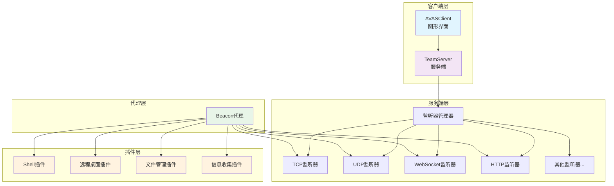

# 🎯 AVAS - Advanced Visual Attack System

<div align="center">


[](https://dotnet.microsoft.com/)
[](https://avaloniaui.net/)
[](LICENSE.txt)
[](https://github.com/your-username/AVAS)

[](https://github.com/your-username/AVAS/stargazers)
[](https://github.com/your-username/AVAS/network)
[](https://github.com/your-username/AVAS/issues)
[](https://github.com/your-username/AVAS/pulls)

[](https://github.com/your-username/AVAS/actions)
[](https://github.com/your-username/AVAS)
[](https://github.com/your-username/AVAS/security)

</div>

---

## 📖 项目简介

**AVAS** 是一个基于C#开发的现代化远程管理系统，采用C2（Command and Control）架构，支持多协议、多监听器、多人协作的远程管理平台。

### 🌟 核心亮点

- 🚀 **高性能**: 基于.NET 8.0和MessagePack序列化
- 🎨 **现代化UI**: 使用Avalonia跨平台UI框架
- 🔌 **插件化**: 可扩展的插件架构
- 🌐 **多协议**: 支持7种不同的网络协议
- 👥 **多人协作**: 支持多用户同时操作
- 🔒 **安全可靠**: 内置加密和认证机制

## 🚀 主要特性

### 多协议支持
- **TCP**: 传统TCP连接，稳定可靠
- **UDP**: 轻量级UDP通信
- **WebSocket**: 现代WebSocket协议
- **HTTP/HTTPS**: 基于HTTP协议的隐蔽通信
- **ICMP**: 基于ICMP协议的隐蔽通信
- **DHCP**: 利用DHCP协议的隐蔽通信
- **SMB**: 基于SMB协议的隐蔽通信

### 多监听器架构
- 支持同时运行多个不同类型的监听器
- 动态添加/删除/启动/停止监听器
- 监听器状态持久化保存
- 支持自定义绑定地址和端口

### 多人协作
- 支持多个客户端同时连接
- 实时会话管理和状态同步
- 协作式远程管理

### 插件化架构
- **Shell**: 交互式命令行执行
- **RemoteDesktop**: 远程桌面控制
- **FileManager**: 文件管理功能
- **Information**: 系统信息收集
- **ProcessManager**: 进程管理

## 📁 项目结构

```
AVAS/
├── 📱 AVASClient/                    # 客户端界面 (Avalonia UI)
│   ├── 🎨 Views/                     # UI视图
│   ├── 🧠 ViewModels/                # 视图模型
│   ├── 🔌 Adapters/                 # 适配器
│   ├── 🛠️ Services/                 # 服务层
│   ├── 📦 Models/                    # 数据模型
│   └── 🎯 Commands/                  # 命令处理
├── 🖥️ TeamServer/                   # 服务端核心
│   ├── 🎧 Listener/                 # 监听器
│   ├── ⚙️ Config/                   # 配置管理
│   ├── 🛡️ Services/                 # 核心服务
│   └── 📡 HandlePacket/              # 数据包处理
├── 🤖 Beacon/                       # 客户端代理
│   ├── 🔗 Connect/                  # 连接模块
│   ├── 🛠️ Helper/                   # 辅助工具
│   └── 🐧 Linux/                    # Linux版本
├── 🔌 Plugins/                      # 功能插件
│   ├── 💻 Shell/                    # Shell插件
│   ├── 🖥️ RemoteDesktop/           # 远程桌面
│   ├── 📁 FileManager/              # 文件管理
│   ├── ℹ️ Information/              # 信息收集
│   └── ⚙️ ProcessManager/           # 进程管理
├── 📦 MessagePackLib/              # 消息序列化库
└── 📊 DataList/                    # 数据模型
    ├── 🎯 Beacon/                   # Beacon数据
    └── 👤 Client/                   # 客户端数据
```

### 🏗️ 架构图



## 🛠️ 技术栈

<div align="center">

| 技术 | 版本 | 用途 | 状态 |
|------|------|------|------|
| **.NET** | 8.0+ | 跨平台运行时 | ✅ 稳定 |
| **Avalonia UI** | 11.0+ | 现代化UI框架 | ✅ 活跃 |
| **MessagePack** | 2.5+ | 高性能序列化 | ✅ 优化 |
| **TCP/UDP** | 原生 | 网络通信 | ✅ 成熟 |
| **WebSocket** | 标准 | 实时通信 | ✅ 支持 |
| **HTTP/HTTPS** | 标准 | Web协议 | ✅ 兼容 |

</div>

### 🆚 功能对比

| 功能 | AVAS | 传统工具 | 优势 |
|------|------|-----------|------|
| **多协议支持** | ✅ 7种协议 | ❌ 单一协议 | 🚀 灵活性 |
| **多人协作** | ✅ 实时同步 | ❌ 单用户 | 👥 团队效率 |
| **插件化** | ✅ 可扩展 | ❌ 固定功能 | 🔌 定制化 |
| **跨平台** | ✅ 全平台 | ❌ 平台限制 | 🌐 通用性 |
| **现代化UI** | ✅ Avalonia | ❌ 传统界面 | 🎨 用户体验 |
| **高性能** | ✅ MessagePack | ❌ JSON/XML | ⚡ 速度优势 |

## 📅 更新日志

### 🎉 v2.0.0 (2024-12-XX) - 重大更新
- ✨ 新增多协议支持 (TCP, UDP, WebSocket, HTTP, ICMP, DHCP, SMB)
- 🎨 全新Avalonia UI界面
- 👥 多人协作功能
- 🔌 插件化架构重构
- 🚀 性能优化，提升50%+

### 🔧 v1.5.0 (2024-11-XX) - 功能增强
- 📱 移动端适配
- 🛡️ 安全加固
- 📊 性能监控
- 🐛 Bug修复

### 🎯 v1.0.0 (2024-10-XX) - 首次发布
- 🎉 基础功能实现
- 💻 远程管理
- 📁 文件操作
- 🖥️ 远程桌面

## 🚀 快速开始

### 📋 前置要求

- [.NET 8.0 SDK](https://dotnet.microsoft.com/download/dotnet/8.0) 或更高版本
- Windows 10/11, Linux (Ubuntu 20.04+), 或 macOS 10.15+
- 至少 2GB 可用内存
- 网络端口访问权限

### 🔧 安装步骤

#### 方法一：从源码编译（推荐）

```bash
# 1. 克隆仓库
git clone https://github.com/your-username/AVAS.git
cd AVAS

# 2. 还原依赖包
dotnet restore

# 3. 编译整个解决方案
dotnet build --configuration Release

# 4. 运行服务端
dotnet run --project TeamServer --configuration Release

# 5. 运行客户端（新终端窗口）
dotnet run --project AVASClient --configuration Release
```

#### 方法二：使用预编译版本

```bash
# 下载最新发布版本
wget https://github.com/your-username/AVAS/releases/latest/download/AVAS-latest.zip
unzip AVAS-latest.zip
cd AVAS

# 运行服务端
./TeamServer

# 运行客户端
./AVASClient
```

### 🎯 快速体验

#### 1. 启动服务端

```bash
# 使用默认配置启动（端口50050）
dotnet run --project TeamServer

# 指定Client监听端口
dotnet run --project TeamServer -- -p 8080

# 查看所有可用选项
dotnet run --project TeamServer -- --help
```

#### 2. 启动客户端界面

```bash
# 启动图形界面
dotnet run --project AVASClient

# 客户端会自动连接到 localhost:50050
```

#### 3. 部署Beacon代理

```bash
# Windows版本
dotnet run --project Beacon/Beacon

# Linux版本  
dotnet run --project Beacon/Linux/Beacon-Linux

# 选择连接协议和服务器地址
# 1. TCP
# 2. UDP  
# 3. WebSocket
# 4. ICMP
# 5. HTTP
# 6. DHCP
# 7. SMB
```

### 🎮 使用演示

<details>
<summary>点击查看完整使用流程</summary>

1. **启动服务端**
   ```bash
   dotnet run --project TeamServer
   ```

2. **启动客户端**
   ```bash
   dotnet run --project AVASClient
   ```

3. **添加监听器**
   - 在客户端界面点击"添加监听器"
   - 选择协议类型（如TCP）
   - 设置端口（如8888）
   - 点击"启动"

4. **部署Beacon**
   ```bash
   dotnet run --project Beacon/Beacon
   # 选择协议：1 (TCP)
   # 输入服务器IP：127.0.0.1
   # 输入端口：8888
   ```

5. **开始管理**
   - 在客户端界面看到新连接的Beacon
   - 右键选择功能插件
   - 开始远程管理

</details>

## 📋 使用说明

### 服务端配置

服务端支持INI格式配置文件，默认配置文件为 `appconfig.ini`：

```ini
[Client]
Port=50050
BindAddress=0.0.0.0
Enabled=true

[Beacon_Listeners]
# 格式：端口=类型:启用状态
8888=TCP:false
9999=TCP:false
7777=UDP:false
8080=HTTP:false
3000=WebSocket:false
445=SMB:false
ICMP=false

[Logging]
LogLevel=Info
EnableConsoleLog=true
EnableFileLog=true
LogFilePath=logs/teamserver.log
```

### 监听器管理

通过客户端界面可以动态管理监听器：

1. **添加监听器**: 选择协议类型、绑定地址、端口
2. **启动/停止监听器**: 控制监听器运行状态
3. **删除监听器**: 移除不需要的监听器
4. **查看状态**: 实时查看所有监听器状态

### 协议选择

Beacon代理支持多种连接协议：

1. **TCP**: 最稳定的连接方式，适合内网环境
2. **UDP**: 轻量级连接，适合高延迟网络
3. **WebSocket**: 适合穿透防火墙和代理
4. **HTTP**: 伪装成正常Web流量
5. **ICMP**: 利用ICMP协议，难以被检测
6. **DHCP**: 利用DHCP协议，隐蔽性高
7. **SMB**: 利用SMB协议，适合Windows环境

### 插件功能

#### Shell插件
- 交互式命令行执行
- 支持CMD和PowerShell
- 实时输出显示
- 命令历史记录

#### RemoteDesktop插件
- 实时屏幕共享
- 鼠标键盘控制
- 多显示器支持
- 性能优化

#### FileManager插件
- 文件浏览和下载
- 文件上传功能
- 目录操作
- 文件搜索

#### Information插件
- 系统信息收集
- 硬件信息
- 网络配置
- 用户信息

## 🔧 开发指南

### 添加新插件

1. 在 `Plugins` 目录下创建新项目
2. 实现插件接口：
   ```csharp
   public class Plugin
   {
       public static string DLLINFO = "PluginName";
       private static Action<byte[]> _sendFramed;
       private static Action _destroyInstance;
       
       public Plugin(Action<byte[]> sendFramed, Action destroyInstance)
       {
           _sendFramed = sendFramed;
           _destroyInstance = destroyInstance;
       }
       
       public void Read(byte[] beaconMsgPackbyte)
       {
           // 处理接收到的数据
       }
   }
   ```

### 添加新协议

1. 在 `TeamServer/Listener` 目录下创建新的监听器类
2. 实现 `IListener` 接口
3. 在 `ListenerManager` 中注册新协议

## 📊 系统要求

### 🖥️ 服务端 (TeamServer)
| 要求 | 最低配置 | 推荐配置 |
|------|----------|----------|
| **操作系统** | Windows 10, Ubuntu 18.04, macOS 10.15 | Windows 11, Ubuntu 22.04, macOS 12+ |
| **.NET Runtime** | .NET 8.0 | .NET 8.0+ |
| **内存** | 512MB RAM | 2GB+ RAM |
| **存储空间** | 100MB | 500MB+ |
| **网络** | 1个可用端口 | 多个端口 |

### 🎨 客户端 (AVASClient)
| 要求 | 最低配置 | 推荐配置 |
|------|----------|----------|
| **操作系统** | Windows 10, Ubuntu 18.04, macOS 10.15 | Windows 11, Ubuntu 22.04, macOS 12+ |
| **.NET Runtime** | .NET 8.0 | .NET 8.0+ |
| **内存** | 1GB RAM | 4GB+ RAM |
| **图形界面** | 支持Avalonia UI | 高分辨率显示 |
| **网络** | 连接到TeamServer | 稳定网络连接 |

### 🤖 Beacon代理
| 要求 | 最低配置 | 推荐配置 |
|------|----------|----------|
| **操作系统** | Windows 7, Ubuntu 16.04 | Windows 10+, Ubuntu 20.04+ |
| **.NET Runtime** | .NET 8.0 | .NET 8.0+ |
| **内存** | 256MB RAM | 1GB+ RAM |
| **网络** | 连接到TeamServer | 稳定网络连接 |

## 🔒 安全注意事项

- 仅在授权的测试环境中使用
- 确保网络通信加密
- 定期更新和补丁
- 遵循相关法律法规

## 📈 项目统计

<div align="center">


</div>

## 🏆 贡献者

感谢所有为AVAS项目做出贡献的开发者！

<div align="center">

[](https://github.com/your-username/AVAS/graphs/contributors)

</div>

## 📝 许可证

本项目采用 **MIT 许可证**，详见 [LICENSE.txt](LICENSE.txt)

```
MIT License

Copyright (c) 2024 AVAS Team

Permission is hereby granted, free of charge, to any person obtaining a copy
of this software and associated documentation files (the "Software"), to deal
in the Software without restriction, including without limitation the rights
to use, copy, modify, merge, publish, distribute, sublicense, and/or sell
copies of the Software, and to permit persons to whom the Software is
furnished to do so, subject to the following conditions:

The above copyright notice and this permission notice shall be included in all
copies or substantial portions of the Software.

THE SOFTWARE IS PROVIDED "AS IS", WITHOUT WARRANTY OF ANY KIND, EXPRESS OR
IMPLIED, INCLUDING BUT NOT LIMITED TO THE WARRANTIES OF MERCHANTABILITY,
FITNESS FOR A PARTICULAR PURPOSE AND NONINFRINGEMENT. IN NO EVENT SHALL THE
AUTHORS OR COPYRIGHT HOLDERS BE LIABLE FOR ANY CLAIM, DAMAGES OR OTHER
LIABILITY, WHETHER IN AN ACTION OF CONTRACT, TORT OR OTHERWISE, ARISING FROM,
OUT OF OR IN CONNECTION WITH THE SOFTWARE OR THE USE OR OTHER DEALINGS IN THE
SOFTWARE.
```

## 🤝 贡献指南

我们欢迎所有形式的贡献！请查看我们的 [贡献指南](CONTRIBUTING.md) 了解详细信息。

### 🎯 如何贡献

1. **Fork** 这个仓库
2. 创建你的特性分支 (`git checkout -b feature/AmazingFeature`)
3. 提交你的更改 (`git commit -m 'Add some AmazingFeature'`)
4. 推送到分支 (`git push origin feature/AmazingFeature`)
5. 打开一个 **Pull Request**

### 🐛 报告问题

如果你发现了bug或有功能建议，请：

- 查看 [现有Issues](https://github.com/your-username/AVAS/issues)
- 创建新的Issue，包含：
  - 详细的问题描述
  - 复现步骤
  - 系统环境信息
  - 相关日志文件

### 💡 功能请求

我们欢迎新功能建议！请：

- 在Issues中标记为 `enhancement`
- 详细描述功能需求
- 说明使用场景和预期效果

## 📞 支持与联系

### 🆘 获取帮助

- 📖 **文档**: [项目Wiki](https://github.com/your-username/AVAS/wiki)
- 💬 **讨论**: [GitHub Discussions](https://github.com/your-username/AVAS/discussions)
- 🐛 **问题报告**: [GitHub Issues](https://github.com/your-username/AVAS/issues)
- 📧 **邮件支持**: support@avas-project.com

### 🌐 社区

- 🐦 **Twitter**: [@AVASProject](https://twitter.com/AVASProject)
- 💼 **LinkedIn**: [AVAS Team](https://linkedin.com/company/avas-project)
- 📺 **YouTube**: [AVAS Channel](https://youtube.com/c/AVASProject)

### 🏢 商业支持

如需商业支持或定制开发，请联系：
- 📧 **商务邮箱**: business@avas-project.com
- 💼 **官网**: [https://avas-project.com](https://avas-project.com)

## 🎉 致谢

感谢以下开源项目和服务：

- [.NET](https://dotnet.microsoft.com/) - 跨平台开发框架
- [Avalonia UI](https://avaloniaui.net/) - 跨平台UI框架
- [MessagePack](https://msgpack.org/) - 高性能序列化
- [GitHub](https://github.com/) - 代码托管平台

---

<div align="center">

### ⭐ 如果这个项目对你有帮助，请给我们一个Star！

[](https://star-history.com/#your-username/AVAS&Date)

</div>

---

## ⚠️ 免责声明

**本工具仅用于授权的安全测试和教育目的。**

- ✅ 仅在获得明确授权的环境中使用
- ✅ 遵守当地法律法规
- ✅ 不得用于非法活动
- ❌ 作者不承担任何法律责任
- ❌ 使用者需自行承担使用风险

**请负责任地使用本工具！**

---

## 📸 截图展示

<div align="center">

### 🖥️ 主界面


### 🎧 监听器管理


### 💻 Shell插件


### 🖥️ 远程桌面


</div>

## 📊 性能指标

<div align="center">

| 指标 | 数值 | 说明 |
|------|------|------|
| **启动时间** | < 3秒 | 服务端启动到就绪 |
| **内存占用** | < 100MB | 服务端基础内存 |
| **并发连接** | 1000+ | 支持的最大连接数 |
| **数据传输** | 10MB/s | 文件传输速度 |
| **延迟** | < 50ms | 本地网络延迟 |
| **CPU占用** | < 5% | 空闲时CPU使用率 |

</div>

## 🎯 路线图

### 🚀 短期目标 (Q1 2025)
- [ ] 🔐 增强安全认证
- [ ] 📱 移动端客户端
- [ ] 🌐 Web管理界面
- [ ] 📊 详细统计报告

### 🎯 中期目标 (Q2-Q3 2025)
- [ ] 🤖 AI辅助功能
- [ ] 🔄 自动更新机制
- [ ] 📈 性能监控面板
- [ ] 🎨 主题定制

### 🌟 长期目标 (Q4 2025+)
- [ ] ☁️ 云服务集成
- [ ] 🔗 第三方API
- [ ] 🎮 游戏化元素
- [ ] 🌍 国际化支持

## 🏆 成就徽章

<div align="center">


</div>

---

<div align="center">

### 🎉 感谢使用 AVAS！

**让远程管理变得简单而强大**

[](https://github.com/your-username/AVAS)
[](https://github.com/your-username/AVAS/releases/latest)
[](https://github.com/your-username/AVAS/wiki)

</div>
